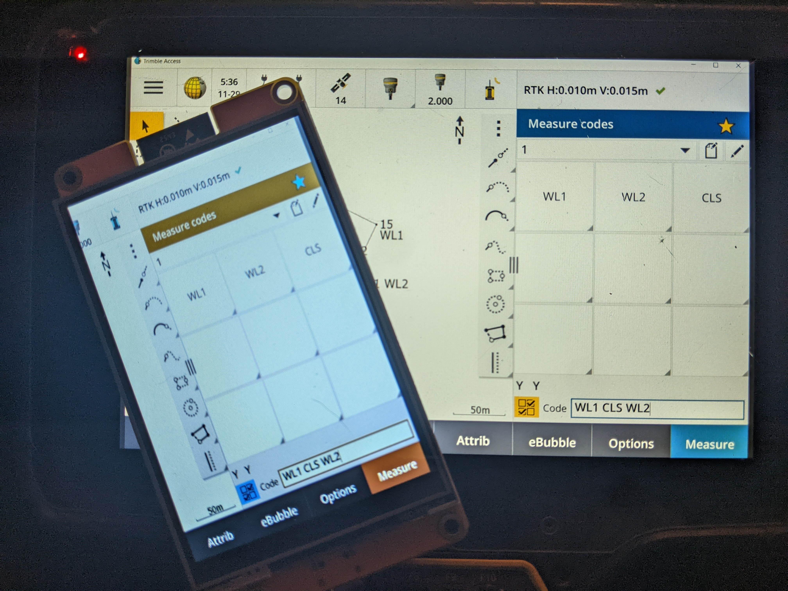

# CYD-Mirror

- Made with Claude AI
- Mirror your Windows desktop to a CYD2USB 2.8" Cheap Yellow Display (ESP32) over WiFi.
- Optimized for the ILI9341 display in 320×240 landscape with high-speed pixel diffing.

# ESP32 CYD Desktop Monitor



### Stream a portion of your PC screen to a CYD2USB 2.8" ESP32-2432S028R (CYD) over WiFi

This project adapts [tuckershannon's ESP32-Desktop-Monitor](https://github.com/tuckershannon/ESP32-Desktop-Monitor) for the **CYD2USB 2.8" ESP32-2432S028R "Cheap Yellow Display"** with an ILI9341 240×320 touchscreen. The original project targeted a 135×240 ST7789 display. All coordinates in the protocol were widened from uint8 to uint16 so the display and the Python transmitter can scale to any resolution.

---

## 🚀 Quick Start

### 1. PC Setup
* **[Python](https://www.python.org/downloads/):** Ensure you have Python 3.x installed.
* **[Arduino](https://www.arduino.cc/en/software/):** Install the [TFT_eSPI](https://github.com/Bodmer/TFT_eSPI) library.
* Run the [Python Script](PC/Transmitter_cyd4.py)

### 2. CYD Configure & Flash (Arduino)
* Open [Receiver_cyd4.ino](CYD/Receiver_cyd4/Receiver_cyd4.ino) in the Arduino IDE.
* Update your WiFi credentials:
   ```cpp
   const char* ssid     = "YOUR_SSID";
   const char* password = "YOUR_PASSWORD";
   ```
* Flash to the CYD

## Hardware

| Part | Details |
|---|---|
| **ESP32 Board** | CYD2USB — 2.8" ESP32-2432S028R "Cheap Yellow Display" (USB-C revision) |
| **Display** | ILI9341 240×320 panel, used in landscape (320×240) — included with board |
| **Touch** | XPT2046 resistive touchscreen — included with board |
| **PC** | Windows, any resolution |

---

## What Was Changed From the Original

The original project used 1-byte (uint8) x/y coordinates, which worked fine for a 135×240 display but is restrictive on larger panels. Every coordinate in the protocol was widened to uint16:

### Protocol changes

| Packet | Original body format | New body format |
|---|---|---|
| PXUP pixel | `x(1) + y(1) + color(2)` = 4 bytes | `x(2) + y(2) + color(2)` = 6 bytes |
| PXUR run | `y(1) + x0(1) + len(1) + color(2)` = 5 bytes | `y(2) + x0(2) + len(2) + color(2)` = 8 bytes |

### Display driver changes
- Driver: ST7789 → **ILI9341**
- Resolution: 135×240 → **320×240 landscape**
- Backlight: **pin 21**, active HIGH
- SPI frequency: **27 MHz**
- Color order: **BGR** (ILI9341 on this board)
- Mirror: `applyColorConfig()` writes a landscape MADCTL; uncomment `TFT_MIRROR_MX` in the `.ino` if the image appears horizontally mirrored

### Python transmitter changes
- Removed all cursor overlay code (macOS only, not needed)
- Captures the **whole primary monitor** (mss `monitors[1]`)
- Scales to fit 320×240 preserving aspect ratio — no stretching/squeezing; if the screen aspect doesn't match the display, the image is centered with black bars (letterboxed)
- Resize interpolation: uses `cv2.INTER_AREA` for better downscaling quality

---

## Setup

### 1. Arduino IDE — `Receiver_cyd4.ino`

**Required libraries:**
- `TFT_eSPI` by Bodmer (via Library Manager)

**`User_Setup.h`** (in your TFT_eSPI library folder):
```cpp
#define ILI9341_DRIVER
#define USE_HSPI_PORT   // TFT on HSPI so the touchscreen can use VSPI
#define TFT_MISO 12
#define TFT_MOSI 13
#define TFT_SCLK 14
#define TFT_CS   15
#define TFT_DC    2
#define TFT_RST  -1
#define TFT_BL   21
#define TFT_BACKLIGHT_ON HIGH
#define SPI_FREQUENCY  27000000
```

**Steps:**
1. Open [Receiver_cyd4.ino](CYD/Receiver_cyd4/Receiver_cyd4.ino) in Arduino IDE
2. Set your WiFi credentials:
   ```cpp
   const char* ssid     = "YOUR_WIFI_SSID";
   const char* password = "YOUR_WIFI_PASSWORD";
   ```
3. Select board: **ESP32 Dev Module**
4. Flash to the CYD
5. Open Serial Monitor at **115200 baud** and note the IP address shown

### 2. Python — `Transmitter_cyd4.py`

**Install dependencies:**
```powershell
pip install opencv-python mss numpy
```

**Run:**
```powershell
python Transmitter_cyd4.py --ip <ESP32_IP>
```

**Choose the monitor to capture** with `--display`:
```powershell
python Transmitter_cyd4.py --ip <ESP32_IP> --display 2   # 1 = primary, 2 = second monitor, ...
```

The script captures the whole monitor, scales it without distortion, and centers it. With `--mode 1` (default) the whole screen fits inside 320×240 with black bars; with `--mode 2` the display is filled and only the center of the screen is shown. Tap-to-click follows the selected mode.

---

## Cursor & Touch Control

- **Mouse cursor** — the transmitter draws the Windows cursor onto the streamed image, so you can see it on the CYD.
- **Tap = move + click** — tapping the CYD touchscreen moves the PC mouse to the matching screen position and left-clicks (on release). Works through the letterbox mapping, so taps land where the image is shown.
- **Touch hardware config** — the sketch uses the [XPT2046_Touchscreen](https://github.com/PaulStoffregen/XPT2046_Touchscreen) library on **VSPI** (pins CLK 25 / MISO 39 / MOSI 32 / CS 33 / IRQ 36), with the TFT moved to HSPI — the same setup as the working [Surrey-Homeware/Aura](https://github.com/Surrey-Homeware/Aura) sketch for this board. Raw-to-pixel ranges are hardcoded from Aura (adapted for landscape 320×240), so **no calibration is needed**.
- **Phantom-touch filter** — any touch reading exactly (0, 0) is ignored (a dead SPI bus reads all zeros). Flip `TOUCH_MIRROR_X` / `TOUCH_MIRROR_Y` in the sketch if taps land mirrored.
- **Pan** — hold the **BOOT** button and drag your finger to move the view around the screen (reveals the parts hidden in mode 2, or the cropped sides in mode 1 once a gesture is used). Single-finger drags without BOOT do nothing (sloppy taps are ignored).
- **Zoom** — **double-tap** toggles 2× zoom anchored on the tapped point; double-tap again zooms back out. (The resistive touchscreen cannot detect two fingers, so pinch gestures are not possible.) Taps are deferred ~400 ms so a double-tap doesn't also click.

---

## Command Line Options

```
--ip <IP>                    ESP32 IP address (required)
--port <PORT>                TCP port (default: 8090)
--display <N>                Monitor to capture: 1 = primary, 2 = second, ... (default: 1)
--mode <1|2>                 Scaling: 1 = fit whole screen with black bars (default), 2 = fill display, show only the center
--zoom <true|false>          Enable double-tap zoom and BOOT+drag pan (default: true; false = plain tap-to-click)
--target-fps <FPS>           Max frame rate (default: 15)
--threshold <N>              Pixel change sensitivity 0-255 (default: 5, higher = less sensitive)
--full-frame                 Send every pixel every frame (no diffing, slower)
--max-updates-per-frame <N>  Updates per packet (default: 3000)
```

---

## Performance Tuning

| Goal | Adjustment |
|---|---|
| Less bandwidth on static screens | Raise `--threshold` (e.g. 15) |
| Higher frame rate | Raise `--target-fps` (e.g. 20–25) |
| Better fast-motion | Raise `--max-updates-per-frame` (e.g. 6000) |
| Snappier display updates | Raise `SPI_TARGET_FREQ` in `.ino` to 40000000 |

---

## Troubleshooting

**White screen** — the display driver or pins in `User_Setup.h` don't match the board. Use the `ILI9341_DRIVER` config above with `TFT_BL 21`; if it still stays white, try `ILI9341_2_DRIVER` (an alternative ILI9341 driver known to fix white screens on this board).

**Black screen / no backlight** — the backlight pin on the CYD2USB is GPIO 21, active HIGH. Confirm `#define TFT_BL 21` and `#define TFT_BACKLIGHT_ON HIGH` in `User_Setup.h`.

**Colors wrong** — try toggling `useBgrSetting` in the `.ino` (true = BGR, false = RGB)

**Image mirrored** — uncomment `#define TFT_MIRROR_MX` in the `.ino` and reflash

**Black bars around the image** — that's the letterboxing: your screen's aspect ratio doesn't match the display's 4:3. The image is scaled to fit without distortion and centered, so black bars are expected on wider screens

**Low frame rate** — check WiFi signal, raise `--threshold`, lower `--target-fps`

**Connection drops** — ensure PC and ESP32 are on the same network, check firewall allows port 8090

---

## Files

| File | Description |
|---|---|
| `CYD/Receiver_cyd4/Receiver_cyd4.ino` | ESP32 sketch for the CYD |
| `PC/Transmitter_cyd4.py` | Python screen capture sender for PC |
| `CYD/touch_diagnostic.ino` | Touchscreen calibration diagnostic (written for the 4" board variant, not calibrated for the CYD2USB) |
| `requirements.txt` | Python dependencies |

---

## Credits

- Original project: [tuckershannon/ESP32-Desktop-Monitor](https://github.com/tuckershannon/ESP32-Desktop-Monitor)
- TFT_eSPI library: [Bodmer/TFT_eSPI](https://github.com/Bodmer/TFT_eSPI)
- Adapted for the CYD2USB 2.8" ESP32-2432S028R with ILI9341 display
